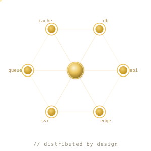

<!--
  ██████  PROJECT SELENE  ██████
  ⚠  GENERATED FILE — do not edit by hand.
  Edit selene.config.json and push; the Build Profile action regenerates this.
  Vishagan · Software Engineer · github.com/ThiruVishagan10
-->

<!-- ══════════ 01 · HERO ══════════ -->

  

<!-- hover the nav for a little terminal flavour · you're already reading the source, nice -->

  <a href="#-about" title="cd ~/about"><samp>about</samp></a> &nbsp;·&nbsp;
  <a href="#-stack" title="ls ./stack"><samp>stack</samp></a> &nbsp;·&nbsp;
  <a href="#-projects" title="git log --oneline"><samp>projects</samp></a> &nbsp;·&nbsp;
  <a href="#-analytics" title="top"><samp>analytics</samp></a> &nbsp;·&nbsp;
  <a href="#-roadmap" title="cat roadmap.2026"><samp>roadmap</samp></a> &nbsp;·&nbsp;
  <a href="#-contact" title="./say-hi.sh"><samp>contact</samp></a>

<!-- ══════════ CONTACT · prioritised, top of profile ══════════ -->

<samp>❯ ./say-hi.sh</samp>

<table align="center">
  <tr>
    <td align="center"></td>
    <td align="center"></td>
    <td align="center"></td>
  </tr>
</table>

<!-- ══════════ 02 · BOOT TERMINAL ══════════ -->

  

<!-- ══════════ 03 · ABOUT ══════════ -->

<h2>❯&nbsp;&nbsp;about</h2>

> I enjoy solving engineering problems by building **scalable backend systems**, **cloud-native applications**, and **AI-powered software**.

Focused on **Go** and **distributed systems**, I like owning products end-to-end — from database schema to deploy. On a mission to become a **world-class Backend Engineer** while shipping things people actually use.

<table>
  <tr>
    <td valign="middle">
      <table>
        <tr><td valign="top"><b>Building</b></td><td valign="top">&nbsp;&nbsp;Task Manager · IdeaPulse · Go URL Shortener · PathBridge</td></tr>
        <tr><td valign="top"><b>Exploring</b></td><td valign="top">&nbsp;&nbsp;Distributed Systems · Cloud-Native · Applied AI</td></tr>
        <tr><td valign="top"><b>Leveling up</b></td><td valign="top">&nbsp;&nbsp;Docker · Redis · gRPC · System Design</td></tr>
        <tr><td valign="top"><b>Off-screen</b></td><td valign="top">&nbsp;&nbsp;Gym · Football · Gaming · Startups</td></tr>
      </table>
    </td>
    <td valign="middle" align="center" width="300">
      
    </td>
  </tr>
</table>

<!-- ══════════ 04 · TECH STACK ══════════ -->

<h2>❯&nbsp;&nbsp;stack</h2>

  

<!-- ══════════ 05 · FEATURED PROJECTS ══════════ -->

<h2>❯&nbsp;&nbsp;projects</h2>

<table align="center" width="90%">
  <tr>
    <td width="50%">
      
    </td>
    <td width="50%">
      
    </td>
  </tr>
  <tr>
    <td width="50%">
      
    </td>
    <td width="50%">
      
    </td>
  </tr>
</table>

<!-- ══════════ 06 · GITHUB ANALYTICS ══════════ -->

<h2>❯&nbsp;&nbsp;analytics</h2>

  

  

  

<!-- Snake contribution animation — populated by .github/workflows/snake.yml (output branch) -->

  

<!-- ══════════ 07 · ROADMAP ══════════ -->

<h2>❯&nbsp;&nbsp;roadmap</h2>

  

<!--
   ⌘ You found the source. The moon favours the curious.
   ❯ echo $MISSION → "build things that outlast the hype"
-->

<samp>❯ sudo reveal --easter-egg</samp>

 
<pre>
       .-.
      (   ).        SELENE // moon protocol
     (___(__)       you read the source — respect.
    ·  ·   ·  ·     that's the kind of engineer I want to build with.
</pre>
The roadmap is a promise, not a wishlist. &nbsp;❯&nbsp; <a href="https://github.com/ThiruVishagan10">follow the build</a>

<!-- ══════════ FOOTER ══════════ -->

  <samp>PROJECT SELENE</samp> &nbsp;·&nbsp; generated from <samp>selene.config.json</samp> &nbsp;·&nbsp; <samp>© 2026 Vishagan</samp>

